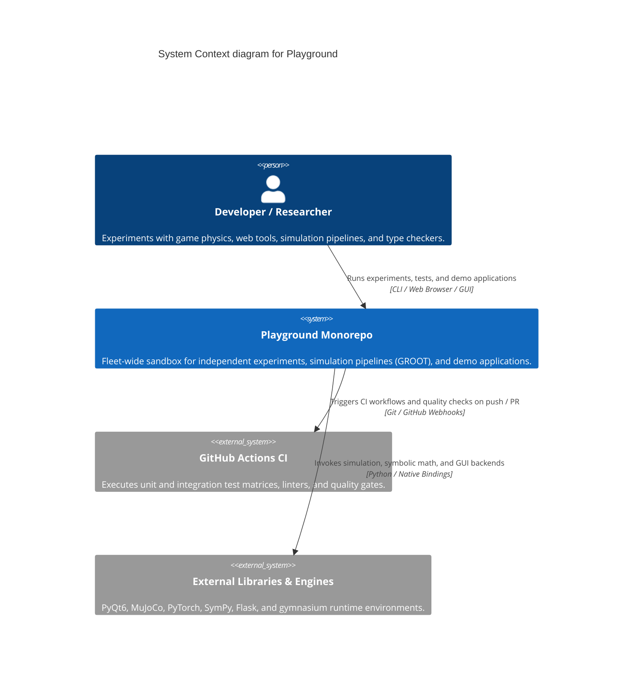
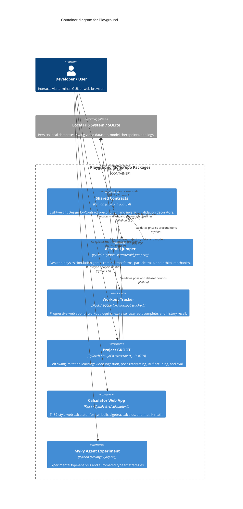

# Architecture Map — Playground

This document defines the canonical Mermaid C4 architecture map for `Playground`, providing verified context, container boundaries, capability-to-component traceability, and architecture change history.

## Context View (C4Context)

## Container View (C4Container)

## Feature Map

| Capability | Component | Interface | Evidence |
| --- | --- | --- | --- |
| Design-by-Contract Helpers | `src.contracts` | `@requires`, `@ensures`, `@invariant` | `tests/test_architecture_dbc.py` |
| Asteroid Navigation & Physics | `src.asteroid_jumper` | `physics.py`, `camera.py`, `particles.py` | `tests/test_asteroid_jumper_physics.py` |
| Workout Logging & Autocomplete | `src.workout_tracker` | Flask app, `/api/health`, SQLite schema | `tests/test_workout_tracker_app.py` |
| Golf Swing Pose Retargeting | `src.Project_GROOT` | `PoseRetargeter.retarget()`, `club_track.py` | `tests/test_Project_GROOT_imitation_retarget_to_sim.py` |
| Imitation Learning Policy | `src.Project_GROOT` | `PolicyNetwork`, `SwingDemonstrationDataset` | `tests/test_Project_GROOT_train_imitation_train.py` |
| Symbolic Calculator Web App | `src.calculator` | Flask webapp, SymPy engine | `tests/test_calculator_webapp.py` |
| MyPy Agent Type Utilities | `src.mypy_agent` | `mypy_agent_types.py`, fix strategies | `tests/test_mypy_agent.py` |
| Architecture Map Contract | `scripts.architecture_map_contract` | `validate_architecture_map()` | `tests/test_architecture_map_contract.py` |

## Architecture Change Log

| Date | PR / Issue | Description |
| --- | --- | --- |
| 2026-09-10 | #1608 | Adopt maintainable Mermaid C4 architecture-map contract and automated CI verification |
