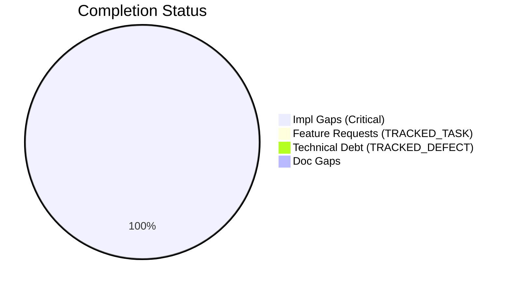
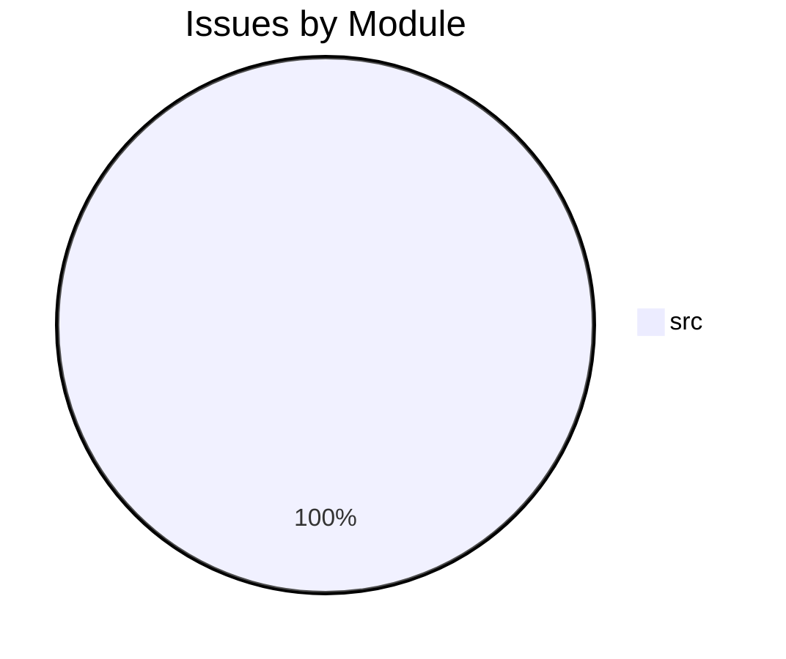

# Completist Report: 2026-08-03

## Executive Summary
- **Critical Gaps**: 10
- **Feature Gaps (TRACKED_TASK)**: 0
- **Technical Debt**: 0
- **Documentation Gaps**: 0

## Visualization
### Status Overview

### Top Impacted Modules

## Critical Incomplete (Top 50)
| File | Line | Type | Impact | Coverage | Complexity |
|---|---|---|---|---|---|
| `./src/Project_GROOT/tools/pose_extractors.py` | 57 | NotImplementedError | 3 | 2 | 4 |
| `./src/Project_GROOT/tools/pose_extractors.py` | 61 | NotImplementedError | 3 | 2 | 4 |
| `./src/Project_GROOT/tools/pose_extractors.py` | 164 | NotImplementedError | 3 | 2 | 4 |
| `./src/Project_GROOT/tools/pose_extractors.py` | 167 | NotImplementedError | 3 | 2 | 4 |
| `./src/Project_GROOT/tools/club_track.py` | 169 | NotImplementedError | 3 | 2 | 4 |
| `./src/Project_GROOT/train/rl_finetune.py` | 121 | NotImplementedError | 1 | 2 | 4 |
| `./src/Project_GROOT/train/rl_finetune.py` | 123 | NotImplementedError | 1 | 2 | 4 |
| `./src/Project_GROOT/eval/rollout_eval.py` | 77 | NotImplementedError | 1 | 2 | 4 |
| `./src/Project_GROOT/eval/rollout_eval.py` | 97 | NotImplementedError | 1 | 2 | 4 |
| `./src/Project_GROOT/eval/rollout_eval.py` | 99 | NotImplementedError | 1 | 2 | 4 |

## Feature Gap Matrix
| Module | Feature Gap | Type |
|---|---|---|

## Technical Debt Register
| File | Line | Issue | Type |
|---|---|---|---|

## Recommended Implementation Order
Prioritized by Impact (High) and Complexity (Low).
| Priority | File | Issue | Metrics (I/C/C) |
|---|---|---|---|
| 1 | `./src/Project_GROOT/tools/pose_extractors.py` | raise NotImplementedError | 3/2/4 |
| 2 | `./src/Project_GROOT/tools/pose_extractors.py` | raise NotImplementedError | 3/2/4 |
| 3 | `./src/Project_GROOT/tools/pose_extractors.py` | raise NotImplementedError("MMPose backend coming soon") | 3/2/4 |
| 4 | `./src/Project_GROOT/tools/pose_extractors.py` | raise NotImplementedError | 3/2/4 |
| 5 | `./src/Project_GROOT/tools/club_track.py` | raise NotImplementedError("Optical flow tracking coming soon") | 3/2/4 |
| 6 | `./src/Project_GROOT/train/rl_finetune.py` | NotImplementedError: Always raised until Isaac Lab is integrated. | 1/2/4 |
| 7 | `./src/Project_GROOT/train/rl_finetune.py` | raise NotImplementedError( | 1/2/4 |
| 8 | `./src/Project_GROOT/eval/rollout_eval.py` | NotImplementedError: Until Isaac Lab integration is complete. | 1/2/4 |
| 9 | `./src/Project_GROOT/eval/rollout_eval.py` | NotImplementedError: Always raised until Isaac Lab is integrated. | 1/2/4 |
| 10 | `./src/Project_GROOT/eval/rollout_eval.py` | raise NotImplementedError( | 1/2/4 |

## Issues Created